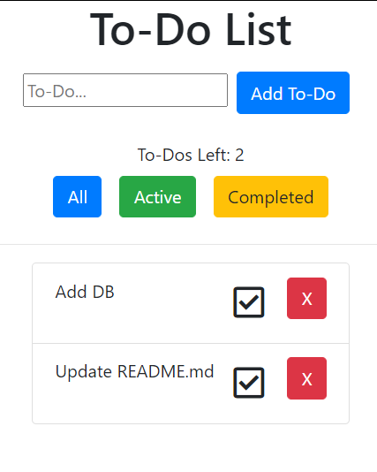

# To-Do App

## Overview
As a user, I want to be able to create a to do list, so that I can keep track of tasks I have to do for a project.

This app was created to practice react skills and handling state. It will be useful for setting up future projects outlines.

## View Demo
[Click Here to Test out the App](http://Rmartinez2020.github.io/todoApp)
 

## Built With

- [Bootstrap](https://www.getbootstrap.com): Framework Used in Project
- [React](https://reactjs.org/): Library used for the front end interface
- [JavaScript](https://www.javascript.com/): Language used to create functionality

## Authors

Rogelio Orosco Martinez - [Rmartinez2020](https://github.com/rmartinez2020)

## Future Updates

- Add a DB so user can have their To-Do items saved
    - Local Storage
    - or add backend to save to MongoDB
- Ability to create multiple To-Do lists that can be easily accessed